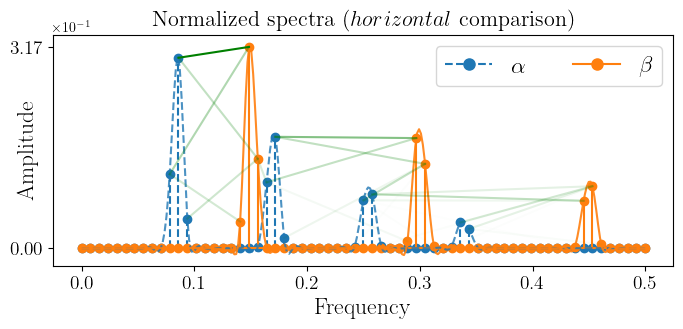
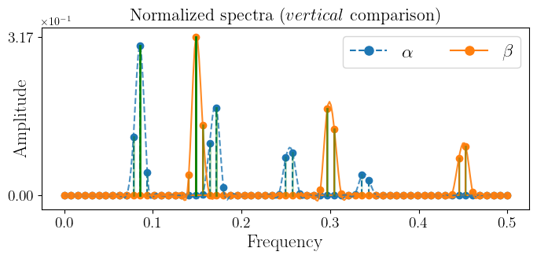
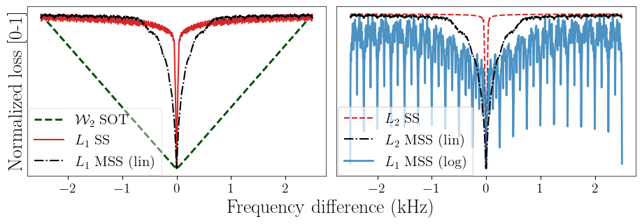
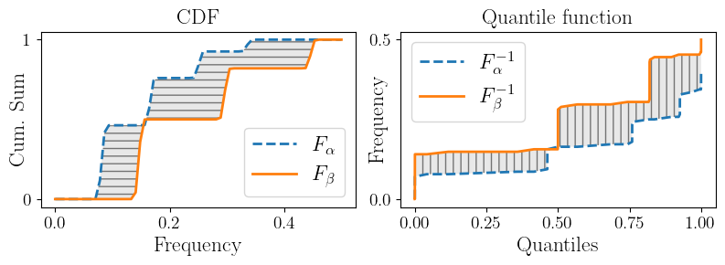

# An optimal transport inspired loss function for improving frequency localization in differentiable DSP

[Paper (arXiv)](https://arxiv.org/abs/2312.14507)
<!-- [](https://arxiv.org/abs/2312.14507) -->

This is the official repository for the paper "[Unsupervised Harmonic Parameter Estimation Using Differentiable DSP and Spectral Optimal Transport.](https://arxiv.org/abs/2312.14507)", by *Bernardo Torres, Geoffroy Peeters, and Gaël Richard*.

We introduce a loss function for comparing spectra *horizontally* inspired by optimal transport. It computes the one dimensional Wasserstein distance between the spectra of two signals, which gives a measure of energy displacement along the frequency axis. 

<!-- Place two figures side by side, add a title above each -->
<table>
  <tr>
    <td>
      <p align="center"><b>We propose doing this  <br>                           </b></p>
      
    </td>
    <td>
      <p align="center"><b>Multi-Scale Spectral loss and others do this</b></p>
      
    </td>
  </tr>
</table>


By computing the gradient of this loss function with respect to the parameters of a signal processor (such as an sinusoidal oscillator), we can improve frequency localization/estimation compared to traditional *vertical* spectral losses (such as the Multi-Scale Spectral loss).

<p align="center">
  
</p>


### Summary
- **Spectral Optimal Transport**: We use a loss function inspired by optimal transport to compare the spectra of two signals.
In the paper we test this loss function on an autoencoding task aimed at estimating the parameters of a harmonic synthesizer (fundamental frequency and amplitudes) and at obtaining good reconstruction.

The [loss function](https://github.com/bernardo-torres/1d-spectral-optimal-transport/blob/4ba751d4cc7b7427ce8a1e7e9ae8320d799deeff/losses.py#L89) was **largely** based on [POT](https://pythonot.github.io/)s implementation of the 1D Wasserstein distance, which computes the quantile functions of the spectra (illustrated below).

<p align="center">
  
</p>


- **Lightweight pitch estimator**: Our encoder uses a lightweight architecture (46K params) based on [PESTO](https://github.com/SonyCSLParis/pesto/tree/master) to estimate the parameters of a harmonic synthesizer (fundamental frequency and amplitudes).
- **Differentiable DSP**: Our decoder is a harmonic synthesizer from [DDSP](https://openreview.net/pdf?id=B1x1ma4tDr) that synthesizes audio from fundamental frequency and amplitude parameters. Even though the decoder is not trained, using automatic differentiation we can compute the gradient of the loss function w.r.t. its input parameters (fundamental frequency and amplitudes).

## Data Description
The synthetic data used for training, evaluation, and testing is available [here](https://drive.google.com/file/d/1_aZzEK82Ko7IjXzyTFZqTtglwIbtnrL3/view?usp=sharing). You can download it and put the file `40_1950_4096_04_1_4000_8_1_harmonic.pth` in a data subfolder. You can use PreloadedSinusoidDataModule in [synthetic_data.py](synthetic_data.py) to load it easily. Code for generating the data is also available.

## Running Experiments

We recommend installing the dependencies in a virtual environment. We provide the conda environment file used [[environment.yml]](environment.yml). If your cuda version checks out, you can run the following commands to create the environment and activate it:

```bash
conda env create -f environment.yml
conda activate sot
```

If using a different environment, please check your PyTorch Lightning and Lightning CLI version for compatibility, as it has been changing a lot recently and some modifications might be needed to run the code.

#### Paper experiments

Configuration files are available in the [paper-experiments](paper-experiments) folder. Each subfolder is an experiment as described in the paper and we provide configuration files for each of the 5 runs with different random seeds.

To run an experiment, run the following command:
```bash
python train.py --config checkpoints/<experiment_name>/<run>/train_config.yaml
```

#### Reproducing results from the paper

We provide pre-trained checkpoints for each experiment [here](https://drive.google.com/file/d/1SubWO5kuwZuDcDzYEpBC5H1AXZBD9dLN/view?usp=sharing). Download the file, extract it (+- 2.6 Gb) and put it under this_project_folder/checkpoints/. The stucture should look like this:
```
checkpoints
├── MSS-LIN
│   ├── $run_$seed
│   │   ├── checkpoints
│   │   │   ├── checkpoint_name.ckpt
│   │   ├── train_config.yaml
│   ├── ...
├── SOT-2048
│   ├── $run_$seed
│   │   ├── checkpoints
│   │   │   ├── checkpoint_name.ckpt
│   │   ├── train_config.yaml
│   ├── ...
...
```


To reproduce the result table from the paper, run:
```bash
python eval_paper.py
```


## Citation


If you find our work useful or use it in your research, you can cite it using:

```bibtex
@article{torres2023unsupervised,
      title={Unsupervised Harmonic Parameter Estimation Using Differentiable DSP and Spectral Optimal Transport}, 
      author={Torres, Bernardo and Peeters, Geoffroy and Richard, Ga{\"e}l},
      journal={arXiv preprint arXiv:2312.14507},
      year={2023},
}

```
